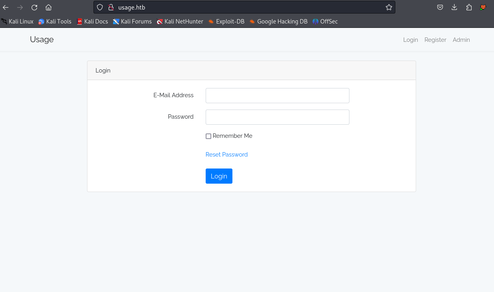
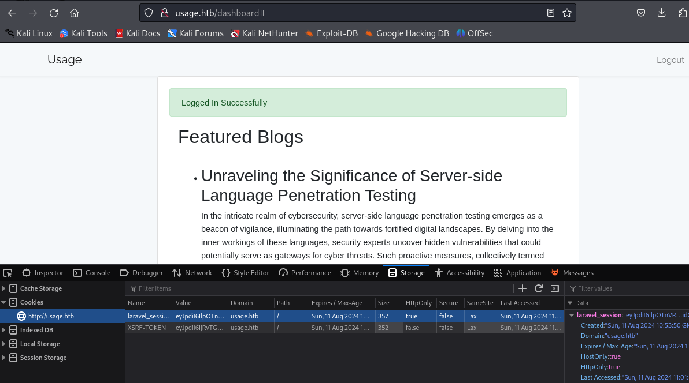

# Recon

## Initial port scanning

```bash
$ sudo nmap -sCV -oA nmap/initial_scan 10.10.11.18
[sudo] password for beast: 
Starting Nmap 7.94SVN ( https://nmap.org ) at 2024-08-11 06:48 EDT
Nmap scan report for 10.10.11.18
Host is up (0.32s latency).
Not shown: 998 closed tcp ports (reset)
PORT   STATE SERVICE VERSION
22/tcp open  ssh     OpenSSH 8.9p1 Ubuntu 3ubuntu0.6 (Ubuntu Linux; protocol 2.0)
| ssh-hostkey: 
|   256 a0:f8:fd:d3:04:b8:07:a0:63:dd:37:df:d7:ee:ca:78 (ECDSA)
|_  256 bd:22:f5:28:77:27:fb:65:ba:f6:fd:2f:10:c7:82:8f (ED25519)
80/tcp open  http    nginx 1.18.0 (Ubuntu)
|_http-server-header: nginx/1.18.0 (Ubuntu)
|_http-title: Did not follow redirect to http://usage.htb/
Service Info: OS: Linux; CPE: cpe:/o:linux:linux_kernel

Service detection performed. Please report any incorrect results at https://nmap.org/submit/ .
Nmap done: 1 IP address (1 host up) scanned in 23.11 seconds
```

It can be seen that port 22 (SSH), 80 (http) are open. `nmap` found a hostname also - `usage.htb`. Accessing the port `80` after adding hostname to `/etc/hosts`.




After registering a user, we can login.



Upon exploring there is a session token of `laravel` . So the back-end using laravel php.


